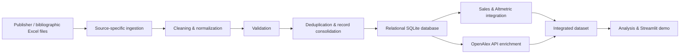

# IberoamericaBooks

> **Portfolio / Demo Version**

IberoamericaBooks is a **Python ETL and relational data-integration project** developed for a real workflow in the Ibero-American book sector. It consolidates heterogeneous publishing catalogues, sales records and digital-attention metrics into a normalized SQLite database.

The original project uses private operational files that cannot be distributed. This public version reproduces the technical architecture with public bibliographic metadata and deterministic synthetic commercial variables. No private rows, credentials or API keys are included.

I developed the code and data workflow manually, using my own Python and data-processing knowledge. AI was used only as limited support for occasional questions about making specific parts of the code more efficient.

## Explore the project

| Resource | Best for | Link |
|---|---|---|
| **Interactive Streamlit demo (recommended)** | Quickly explore the pipeline outputs, consolidated catalogue, provenance, synthetic sales and SQLite queries | [Launch demo](https://iberoamericabooks-etl.streamlit.app/) |
| **Technical ETL notebook** | Inspect the reproducible Python workflow step by step | [View notebook](https://nbviewer.org/github/DiegoJSN/iberoamericabooks_demo/blob/820e4232260668a7cbff0fc1d3d52ceebe9d0691/notebooks/iberoamerica_books_demo.ipynb?flush_cache=true) |
| **Original development notebook** | Review the original long-form development process, diagnoses, cleaning decisions and exploratory code | [View sanitized original](https://nbviewer.org/github/DiegoJSN/iberoamericabooks_demo/blob/9b9bbd6c73ba8041267d1d10f567ba1f938b99be/notebooks/archive/iberoamerica_books_original_sanitized.ipynb?flush_cache=true) |

> The **Streamlit application is a portfolio interface for exploring the outputs of the ETL pipeline**. The core of the project is the Python data-processing and relational database workflow, which can be inspected in detail in the technical and original development notebooks.

## What this project demonstrates

- **Python ETL design** for heterogeneous Excel and CSV sources
- **Data cleaning, normalization and validation** with pandas
- **Record linkage and deduplication**
- **REST API integration** with OpenAlex
- **Relational data modelling** and SQLite persistence
- **Data provenance and row-level traceability**
- **SQL querying and analytical views**
- **Reproducible data workflows**
- **Automated testing** of critical pipeline behaviour
- Separation between reusable **data-processing logic** and the presentation layer

## Workflow

The workflow starts with Excel files from different publishing data sources, each with its own structure, field names and data-quality issues. I load and process each source separately in Python, applying source-specific cleaning rules before transforming them into a common structure. ISBNs, titles, authors, publishers, publication dates and other bibliographic fields are normalized and validated, while invalid records are identified and duplicate editions appearing across multiple sources are reconciled. The cleaned records are then loaded into a relational SQLite database, where books, editions, authors, publishers and their relationships are stored in separate linked tables.

Once the core catalogue has been consolidated, the workflow enriches it with information from additional sources. Sales and alternative-metrics data are linked to the corresponding editions using ISBNs, while OpenAlex is queried programmatically to retrieve bibliographic information such as DOIs and citation counts. Because OpenAlex cannot be searched directly by ISBN for this use case, I implemented a matching procedure that compares titles and authors and scores candidate results before accepting a match. The original development workflow also explored WorldCat as an additional bibliographic source, although its API was not integrated into the final pipeline because access requires specific credentials or subscription permissions.



The demo preserves the main stages of the original workflow:

1. **Ingestion** of heterogeneous publishing data
2. **Diagnosis and normalization** of source-specific fields
3. **Validation** of identifiers and records
4. **Deduplication and consolidation** into a common catalogue
5. **Enrichment** with sales, alternative metrics and OpenAlex data
6. **Persistence and auditing** in a relational SQLite database

Accepted and rejected source rows remain traceable throughout the workflow.

## Project structure

```text
app.py                         Streamlit portfolio interface
src/iberoamerica_books/       Cleaning, ETL and SQLite logic
demo_data/                    Redistributable semisynthetic source files
fixtures/                     Deterministic fallback data
notebooks/
├── iberoamerica_books_demo.ipynb
└── archive/
    └── iberoamerica_books_original_sanitized.ipynb
scripts/create_demo_data.py   Fixed-seed demo-data generator
scripts/build_notebook.py     Reproducible technical notebook builder
tests/                        Critical pipeline checks
requirements.txt              Python dependencies
run_demo.bat                  Windows launcher
run_demo.sh                   macOS/Linux launcher
```

## Technical notebook

The [technical ETL notebook](https://nbviewer.org/github/DiegoJSN/iberoamericabooks_demo/blob/main/notebooks/iberoamerica_books_demo.ipynb) is the recommended resource for inspecting the code-first workflow.

It shows the complete SQLite DDL, diagnoses each source dataframe, documents the fields that require cleaning, resolves validation and deduplication decisions step by step, and audits the final database.

The notebook calls the same reusable ETL package as the Streamlit application, avoiding separate implementations of the core workflow.

When executed, the notebook queries the OpenAlex `/works` API for catalogue records and stores the selected candidate, DOI, citation count, source and matching scores in SQLite.

Basic use does not require an API key. An optional key can be supplied only through the `OPENALEX_API_KEY` environment variable. No secret is stored in the repository.

If OpenAlex is unavailable, affected rows use an explicitly labelled fixture fallback so the ETL can still complete.

## Original development notebook

The [sanitized original development notebook](https://nbviewer.org/github/DiegoJSN/iberoamericabooks_demo/blob/main/notebooks/archive/iberoamerica_books_original_sanitized.ipynb) preserves the original long-form development workflow.

Unlike the reproducible demo notebook, it retains the sequence of exploratory analyses, diagnoses, data-cleaning decisions and development code used while building the original project.

Only saved outputs, execution metadata, private row examples, internal identifiers and private report names were removed or replaced. Because the original private source workbooks cannot be distributed, this notebook is intended primarily for **code and development-process inspection**, rather than direct execution.

## Run locally

### Windows

1. Install [Python 3](https://www.python.org/downloads/) and enable **Add Python to PATH** during installation.
2. Download this repository as a ZIP and extract it.
3. Double-click `run_demo.bat`.
4. The required packages are installed and the Streamlit application opens automatically.

### macOS or Linux

```bash
git clone https://github.com/DiegoJSN/iberoamericabooks_demo.git
cd iberoamericabooks_demo
chmod +x run_demo.sh
./run_demo.sh
```

The application opens at:

```text
http://localhost:8501
```

## Technology

- **Python**
- **pandas**
- **SQLite / SQL**
- **OpenAlex REST API**
- **Streamlit**
- **Excel and CSV**
- **unittest**

## Data and limitations

This repository is a sanitized public portfolio version of a project originally developed with private operational data.

- Bibliographic examples link to Open Library records for provenance.
- Sales, revenue, attention metrics and invalid control rows are synthetic.
- Synthetic commercial variables are generated deterministically so the demo remains reproducible.
- OpenAlex results are live and may change over time.
- The notebook includes an explicit offline fallback for API-dependent enrichment.
- WorldCat and Altmetric are documented as parts of the original workflow but are not called with private credentials in this public version.
- The reduced dataset demonstrates the **technical workflow and architecture**, not the scale or business conclusions of the private project.

## Verify

Run the automated checks with:

```bash
python -m unittest discover -s tests -v
```
